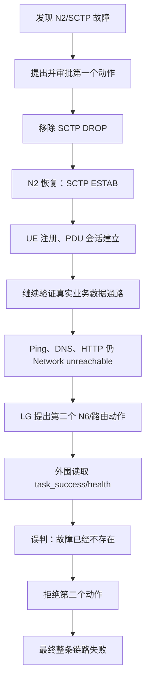
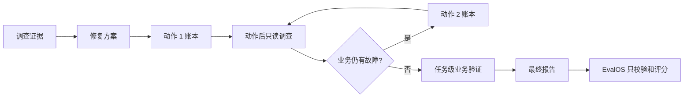
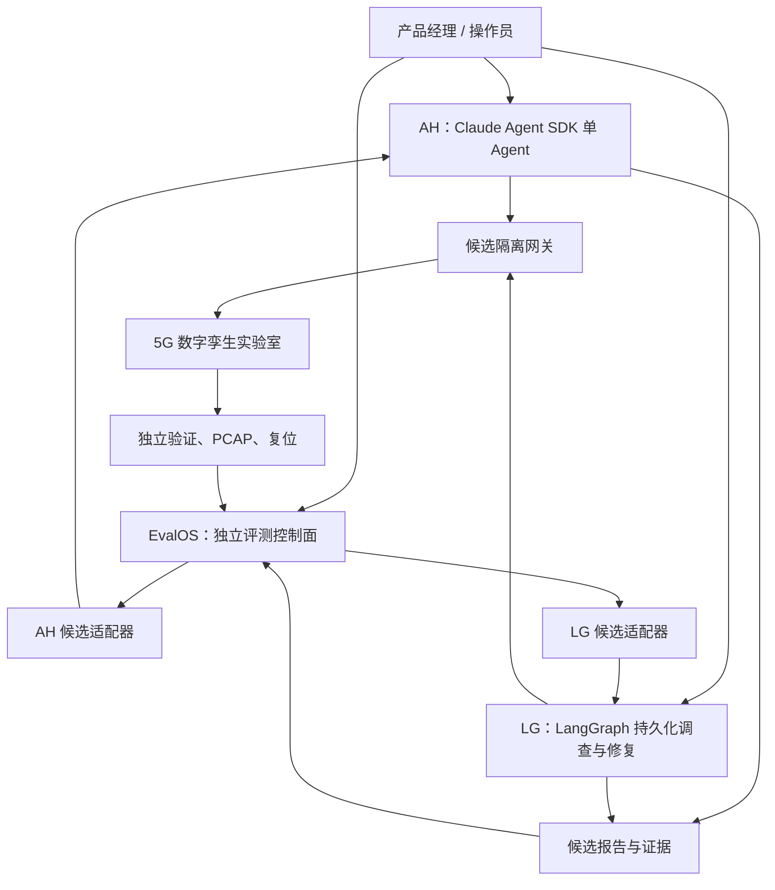

# OpsMind 智能运维 Agent 全景接管 HANDOFF（Claude Code）

> 更新时间：2026-09-11（Asia/Shanghai）  
> 用途：让新的 Claude Code 会话快速掌握 AH、LG、EvalOS、5G 实验室，以及四条端到端链路的真实状态。  
> 性质：事实索引和接管说明，不代表新的代码、部署或真实验室操作授权。动态状态在执行前必须复核。

## 0. 先看结论：当前最需要解决什么

AH 的两条链路已经在准确版本上通过；现在未完成的是两条 LG 链路。

| 链路 | 当前结论 | 最近准确结果 | 主要卡点 |
|---|---|---|---|
| AH → 5G 实验室 | 已通过 | 2026-09-07 连续两轮通过 | 无当前阻塞；AH 的回滚语义和恢复判断有已登记问题，按产品经理要求等 LG 两链路通过后再处理 |
| AH → EvalOS → 5G 实验室 | 已通过 | 100 分、96.43 分，均 15/15 硬门通过 | 无当前阻塞 |
| **LG → 5G 实验室** | **未通过** | 2026-09-10 direct04：第一个 N2 修复成功，整条数据通路仍失败，第二个动作被错误阻止 | **外围各层把“局部动作成功”“场景步骤成功”“业务整体恢复”混成同一个状态** |
| **LG → EvalOS → 5G 实验室** | **未通过且最新版尚未验收** | 最近实际运行的是旧 LG `c8eb80c`，42.86 分、12/15 硬门；当前 LG `e34773b` + EvalOS `41d99bc` 尚未跑正式资格 Trial | LG 自身最终结果语义不完整；EvalOS 接收端按“最后一个动作”理解整体恢复；准确新组合还没有完整跑过 |

Claude Code 接手后要先解决一个核心问题：**系统必须分别记录并判断动作结果、故障项结果和整条任务结果。** 一个动作成功，只能说明这一个动作有效；只有修复后的业务验证全部通过，才能宣布整条任务恢复。

## 1. LG 两条链路的重点问题

### 1.1 LG → 5G 实验室：direct04 到底发生了什么

最近一轮是 `lg-current-plan-20260910-direct-04`，调查编号 `inv-978c...`，LG 准确提交 `e34773bd0484b33bf0c101d70d1262fd67190447`。

过程可以用下面这张图理解：

这里没有发生“第一个动作其实失败”。第一个动作确实修好了 N2 信令连接。失败发生在更高一层：业务数据通路没有恢复，而外围系统把实验室某个较窄的 `task_success=true` 当成了“全局已经健康”，于是拒绝了后续必要动作。

同一个动作回执中同时出现了以下事实：

- `task_success=true`；
- `ping_dn=false`；
- `dns=false`；
- 丢包率 100%；
- 后续探测报告 `Network unreachable`；
- UE 路由缺少到目标网段的可用路径。

这组事实本身不矛盾：`task_success` 只说明实验室当前这个动作或场景子目标完成，不能代表用户业务恢复。错误在于 LG 外围把它映射成了全局 `health`，再推导出 `fault_still_present=false`，策略层因此拒绝第二个动作。

#### 已经证实的问题

1. **三种结果被混用。**
   - 动作是否执行成功；
   - 动作针对的故障是否消失；
   - 整条业务是否恢复。
   现有外围在实验室适配器、策略层、最终报告和 EvalOS 接收端之间没有统一语义。

2. **局部成功会提前关闭修复循环。**
   N2 修好后，本应回到只读调查，确认 N3/N6、UE 路由、DNS、HTTP 等业务路径；现在策略层却把局部成功解释为“不再有故障”。

3. **最后一个动作会污染任务级结论。**
   `repair_delivery` 倾向使用最后一个 proposal/action 推导整体恢复。direct04 的最后一个提案尚未执行，这会覆盖前一个动作的真实成功，也无法表达“已修好一处，仍有一处待修”。

4. **最终根因表达过于粗。**
   已确认的 N2 局部根因，在最终总体失败时可能被压成 `root_cause=null` 或只保留 `probable`，导致报告看起来像 Agent 什么都没有查清。

5. **策略拒绝后的流向不合理。**
   对过时、证据冲突或仅允许调查的提案，策略层直接结束任务；合理做法应是关闭这张提案，回到只读调查。用户停止、熔断、未知写操作等安全边界仍应立即停止。

#### 尚未证实、必须用同一 Trial 证据验证的假设

direct04 日志提示 N6/NAT/返回路由可能还有问题：UE 流量可能被改写到一个 MEC 没有返回路由的源地址，且转发计数只见出站。这个解释很有可能，但目前不能写成最终根因。必须在同一轮中同时采集：

- UE 隧道接口上的请求与返回包；
- UPF/NAT 规则命中计数；
- conntrack 状态；
- MEC 返回路由；
- 使用相同源接口、目标和成功标准的前后探测。

#### 探测口径也需要对齐

LG 的部分 `probe_ip/http/dns` 没有明确绑定 UE 隧道，而实验室 verifier 的连通性探测绑定了 `uesimtun0`。两种探测从不同网络入口发起，结果不能直接互相证明。下一版应由任务级验证声明固定的源接口、目标、协议和成功标准，所有层引用同一份结果。

### 1.2 LG → EvalOS → 5G 实验室：为什么现在还不能验收

最近真正运行过的 EvalOS 链路使用的是较旧组合：

- LG：`c8eb80c`；
- EvalOS：`e791574`；
- 请求：`eval-request_49e45...`；
- 实验：`exp_87c...`；
- Trial：`trial_e650...`；
- 得分：42.86；
- 硬门：12/15；
- 资格：不通过。

这轮中动作和独立修复验证是有效的，但 LG 在修复成功后直接生成最终报告，没有回到调查环节补全“修复后因果复核”，因此根因字段为空。EvalOS 如实保留了这个缺口，没有替 LG 猜根因。

当前线上候选已经更新为：

- LG：`e34773b`；
- EvalOS：`41d99bc`；

EvalOS `41d99bc` 已部署并通过标准烟测，但这两个准确版本**还没有一起完成正式资格 Trial**。因此不能用旧 Trial 加新版本局部测试拼成“最新版已验收”。

这条链路还受 direct04 同一个语义问题影响：EvalOS 接收端如果只看 LG 的最后一个动作，就无法正确表达：

> 第一次修复成功，第二个问题仍存在；或者第一次修复失败、第二次修复成功，最终业务已经恢复。

历史动作必须逐条保留，最终状态必须由独立的任务级业务验证决定。评分权重、历史事件和真实失败记录不能为了过关而改写。

### 1.3 推荐的最小、完整修复边界

目标是统一一种结果合同，而不是继续增加兼容分支。

只保留三层明确状态：

| 层级 | 回答的问题 | 数据要求 |
|---|---|---|
| Action | 这个具体动作是否执行成功、是否有效 | 每个动作独立、追加写、不可覆盖历史；可回滚就写可靠逆动作，不可可靠回滚则回滚为空 |
| Issue | 这个故障项是否已确认、已修复、仍存在或被新证据推翻 | 可同时存在多个 issue；保留各自根因和证据 |
| Task | 用户要求的业务是否整体恢复 | 只由修复后的统一业务验证决定，不读取某个动作的 `task_success` 代替 |

建议只改以下边界：

1. LG 内部增加/收敛为一个任务级结果投影器，输入是 issue 状态、动作账本和统一业务验证，输出唯一的任务结论。
2. 实验室适配器把 `task_success` 原样保存为场景或动作信号，禁止映射为 LG 全局健康。
3. 策略层只审批当前不可变申请单及其摘要；判断方案是否合理所需的证据摘要在申请单生成时冻结。审批接口无需每次重放整本调查日志。
4. 策略层对“提案过时/证据冲突/只允许调查”返回调查循环；只有安全停止类原因终止任务。
5. 每个写动作完成后必须回到调查，再决定是否需要下一动作。一个方案可以描述多个预期步骤，但每个有风险的写动作仍有自己的证据、审批/票据、结果和复核。
6. EvalOS 的 LG 接收逻辑只接收并校验 LG 发布的任务级结果与完整动作历史，不再自行用最后一个动作推断整体恢复。
7. 删除旧的冲突语义和兼容路径，做一次明确的 break change；不保留两套判断规则。

需要特别审查实验室控制器中的 `minimal_change = len(changes) == 1`。多步骤修复不应因为动作数量大于 1 就自动判失败。若修改共享实验室控制器，必须先证明不会破坏 AH 两条已通过链路，并取得当次审批。

## 2. 四个平台的职责和边界

### 2.1 AH（Agent + Harness）

- 核心是官方 `claude-agent-sdk` 的 `ClaudeSDKClient` 单 Agent 循环。
- 生产模型通过 DeepSeek 的 Anthropic 兼容端点运行。
- Agent 动态选择假设、工具和停止时机；不引入 LangGraph、静态状态机、意图分类器或多 Agent 路由。
- 外围负责 30 个 OpsMind MCP 工具、17 个 Skills、权限范围、审批、动作控制、独立验证、审计和追踪。
- MySQL 8 的 `opsmind_v23` 是持久事实源，Redis 7 用于缓存、去重和锁。
- 当前 AH 不在 LG 修复范围内。已登记但推迟的问题：回滚动作不是严格的逐动作逆操作；恢复判断过度依赖“健康/不健康”布尔值。

### 2.2 LG（LangGraph）

- 核心是 `StateGraph`、持久 checkpoint、interrupt/resume 和流式事件。
- 一个主调查 Agent 动态选择已授权 MCP 工具，Knowledge Pack 提供领域知识。
- MySQL 保存业务数据，PostgreSQL 独立保存 checkpoint，Redis 使用独立命名空间，OSS 保存私有证据归档。
- 通用外围节点覆盖接入、调查、证据门、提案、审批、票据、租约、执行、验证、回滚、安全停止、归档和最终报告。
- 当前问题主要位于这些外围节点之间的结果合同，不是模型核心或 LangGraph 本身必然错误。

### 2.3 EvalOS

- EvalOS 是独立评测操作系统和控制面，不是 AH/LG 的业务运行时。
- 它冻结案例、种子、盲身份、隔离、安全边界、预算、评分器和不可变账本。
- 正式分数只来自确定性 Code Grader；模型评审只能提供建议。
- 它通过候选注册、适配器、relay/presence 和签名公开证据接入候选。
- EvalOS 应校验候选发布的事实并评分，不应替 LG 猜测是否恢复。

### 2.4 5G 数字孪生实验室

- Open5GS 2.8.0、MongoDB 8.0.29、UERANSIM 3.2.7。
- 物理环境共享，所有候选必须通过独占串行租约运行；身份包括 `owner_mode`、`candidate_ref`、`trial_id`、`lease_id` 和 `boot_id`。
- 场景具备确定性的 prepare、observe、action、snapshot、reset 和 PCAP。
- 5G 实验室源码放在 EvalOS 仓库，但控制器有独立版本、发布包和生产标签。
- 候选之间不得共享 trace、运行态或证据。

## 3. 四条链路的验收事实

### 3.1 AH → 5G 实验室

2026-09-07 在 AH `b13c5f5`、实验室 `8e859e8` 上连续两轮通过：

- direct05：`inv-6fe51...`，N2 修复成功，独立 UE DNS `NOERROR`、MEC HTTP 200，证据归档并复位。
- direct06：`inv-dca934...`，保留了先报告后审批的真实历史，后续审批、动作和独立验证通过，操作员显式复位。

### 3.2 AH → EvalOS → 5G 实验室

相同准确 AH/实验室版本和 EvalOS `006172e`：

- `trial_5d5be305d041cd75c5b8`：100 分，15/15 硬门。
- `trial_d67622ca210bb9181a52`：96.43 分，15/15 硬门；缺少故障窗口 SCTP PCAP 的扣分被如实保留。

### 3.3 LG → 5G 实验室

最新 direct04 整体失败。第一个 N2 动作成功；业务数据通路未恢复；第二个动作因为状态语义错误被策略阻止。完整证据已封存，实验室已复位。

### 3.4 LG → EvalOS → 5G 实验室

最近正式 Trial 是旧组合，42.86 分、12/15 硬门，不通过。当前 LG `e34773b` 与 EvalOS `41d99bc` 尚未进行同一准确组合的完整资格 Trial。

## 4. GitHub 血缘与线上准确版本

### 4.1 仓库地址

| 产品 | GitHub |
|---|---|
| AH | `https://github.com/ZhoujingGitHub/OpsMind.git` |
| LG | `https://github.com/ZhoujingGitHub/OpsMind-LangGraph.git` |
| EvalOS + 5G 实验室源码 | `https://github.com/ZhoujingGitHub/OpsMind_Agentic_EvalOS.git` |

### 4.2 AH

- `main` / `origin/main` / 本地 HEAD：`b13c5f54b94945d07f960a703a75b6a5d70eaa46`。
- 生产标签：`prod-agent-harness-20260907-evidence-delivery` → `b13c5f5`。
- 生产镜像摘要：`253d63f00dc76583dcf685854756993279f508a8295ed8c66e967c9234466905`。

### 4.3 LG

- 已接受稳定 `main` / `origin/main`：`f99d3775fb717435f9bfb5cd7b1f85bc389377f1`。
- 稳定标签：`prod-langgraph-20260902-model-output-recovery` → `f99d377`。
- 当前远端候选分支：`codex/langgraph-feature-ah-tool-parity-20260908`。
- 当前候选/线上提交：`e34773bd0484b33bf0c101d70d1262fd67190447`。
- 血缘：`f99d377 → … → de6cbf3 → ff5ecc9 → 82611f1 → fe1e415 → c6d1d78 → c8eb80c → 8541bf1 → 1df3d21 → e34773b`。
- 当前镜像摘要：`c4c7941d7ef5dbeeaed9d245f1cf1769ac30bd6e113d634f3cec42c58f04010b`。
- release：`e34773bd0484`；previous：`1df3d2193570`；数据库迁移：`20260909_0013`。
- `e34773b` 尚未验收，**不得提升到 main 或建立生产标签**。

特别注意：`D:\AIPM\黄钊+张和AIPM训练营\5期\从0到1打造一个Agent落地产品\OpsMind-LangGraph` 顶层当前仍指向废弃/旧分支，HEAD `38112d344deee742c4c51c993700f54adfb41aa2`。它只可用于查历史，禁止构建、部署或继续开发。当前正确 LG 工作树是：

`D:\AIPM\黄钊+张和AIPM训练营\5期\从0到1打造一个Agent落地产品\OpsMind-LangGraph\runtime\codex-migration-20260903\candidates\report-evidence`

### 4.4 EvalOS

- 已接受稳定 `main` / `origin/main`：`006172e86b704f3740149372fd8756b62f5e718f`。
- 稳定标签：`prod-evalos-20260907-evidence-grading` → `006172e`。
- 当前候选分支：`codex/evalos-feature-diagnosis-advice-grading-20260909`。
- 当前候选/线上源码：`41d99bc40421e4ec4552a002b640487c342eafac`。
- Sep10 release：`m31-20260910-35690b073b`；归档摘要：`6e81c4084baec0abc51f52d1c28cb179039d0b39f6d401585de659896522986c`。
- 标准烟测通过，但尚未随 LG 当前候选完成正式资格 Trial，不能提升 main/tag。

### 4.5 5G 实验室控制器

- 已接受提交：`8e859e82158479688f48efae0df04e353ffb5356`。
- 标签：`prod-twin-20260907-network-evidence`。
- release：`twin-controller-20260907-13646b0db8`。
- 内容摘要：`13646b0...`。
- 最近一次已验证复位：2026-09-10 08:42:32 UTC，`clean=true`、租约 idle。它是历史快照，下一次 Trial 前仍需复核。

## 5. 阿里云资源及当前使用

三台 ECS 都在 `cn-hangzhou`，跨两个账号/VPC。数据库端口不对公网开放，候选通过已认证、签名的适配器和 relay 通信。

| 角色 | 实例 / 地址 | 规格与磁盘 | 当前用途与状态 |
|---|---|---|---|
| 产品服务器 | `i-bp12nyanjsyue1vs5bu6`；公网 `114.55.40.170`；内网 `172.19.130.244` | Ubuntu 22.04；2 vCPU / 8 GiB；约 40 GiB 系统盘 | AH、LG API/worker、MySQL/Redis、LG PostgreSQL/Redis、OSS relay/archive。2026-09-11 05:15:48 UTC：负载约 0.47/0.58/0.57，可用内存约 5.54 GiB，磁盘空闲约 11.25 GiB；AH 与 LG 容器运行中 |
| EvalOS 服务器 | `i-bp14ezltpnq8mxic1gsb`；公网 `121.40.223.202`；内网 `10.20.1.156` | 4 vCPU / 8 GiB；40 GiB ESSD Entry | EvalOS 控制面/UI。公网 80 仅 `/32` 放行；8787 仅回环并由代理转发。Sep10 候选部署和烟测通过；Sep11 云 CLI 身份初始化失败，未取得新的 CPU/磁盘快照 |
| 5G 实验室 | `i-bp19u0lim79nhh4y7fkg`；公网 `114.215.189.185`；内网 `10.30.1.135` | 4 vCPU / 16 GiB；40 GiB 系统盘 + 100 GiB 数据盘；数据挂载 `/srv/opsmind-twin` | 共享独占实验室，无公网业务端口。最后已验证为 Sep10 clean/idle；Sep11 普通资源快照因实验身份安全规则未执行 |

安全的云配置名称可以记录，但不得把凭据写入文档或 Git：

- 产品/实验室：`opsmind-main-oauth`；
- EvalOS：`opsmind-evallab`。

计费状态不在代码证据中。操作员曾报告第二台 ECS 欠费，早前短信显示个人版免费额度耗尽后按量计费。当前欠费金额、续费日期、计费方式和是否已恢复必须在阿里云费用中心/ECS 控制台现场确认，不能因服务能访问就推断已经不欠费。

## 6. Claude Code 的接管顺序

### 阶段 A：只读复核，不改代码

1. 从本文件和第 8 节材料入口建立事实表。
2. 在三个正确工作树中核对 `git status`、分支、HEAD、远端候选、祖先关系和标签；不得清理现有未提交或未跟踪文件。
3. 读取 direct04 完整事件包，画出 action、issue、task 三种状态在每层的字段映射。
4. 找到 `task_success → health → fault_still_present → policy` 的准确代码路径。
5. 找到 `repair_delivery`、最终报告和 EvalOS LG receiver 使用“最后动作”的准确路径。
6. 对 N6/NAT 只列待验证假设，不在缺少同轮 PCAP/conntrack/路由证据时下结论。

### 阶段 B：提交一个完整、轻薄的改造方案

在任何代码、配置、迁移、分支、构建、部署或真实 Trial 前，按各仓库 `AGENTS.md` 向产品经理列出并等待当次明确批准：

- 当前接受的 `main`；
- 准确线上提交和生产标签；
- 已知问题；
- 拟修改内容；
- 明确不动的核心；
- 拟建分支中文名和准确分支名；
- 测试；
- 部署；
- 可靠回滚；不可可靠回滚的动作写空，不伪造回滚。

方案应以一次 break change 统一结果合同，删除旧冲突规则，不为旧候选保留兼容层。不要修改 AH。若确需修改 EvalOS，只限 LG 候选登记或 LG 结果接收合同，不能改评分权重、历史账本或其他候选逻辑；仍需先取得当前任务授权。

### 阶段 C：实现与本地验证

最少应覆盖这些行为：

1. 第一个动作成功但业务未恢复时，系统回到调查并允许提出第二个动作。
2. 某动作失败、后续动作成功且统一业务验证通过时，历史失败保留，任务结果是“已恢复”，说明尝试顺序。
3. 最后一个 proposal 未执行时，不得覆盖此前动作结果或任务级验证。
4. 策略拒绝过时提案时回到只读调查；安全停止仍终止。
5. root cause 能同时表达已确认的局部根因和仍待确认的问题。
6. EvalOS 接收完整历史和唯一任务级结果，不通过最后动作猜结果。
7. 多动作不因数量本身被判失败。
8. AH 两条已通过链路的共享实验室合同不回归。

### 阶段 D：候选发布和两条 LG 链路验收

1. 候选提交必须先推到远端候选分支，再构建和部署。
2. 使用共享实验室独占串行窗口；一轮只跑一条链路。
3. 每轮封存证据、记录准确 commit/image/controller 版本，再复位实验室。
4. 先跑 LG → 5G；成功后再跑 LG → EvalOS → 5G。
5. 产品经理此前要求：验收一轮后，无论成功或失败都停下来共同讨论。执行新 Trial 前应重新确认这条交互要求是否仍适用。
6. 两条都通过后，才将候选收回 `main`、推送 `origin/main`、创建不可变可读生产标签，并核对线上提交。

## 7. 不可破坏的工程和安全规则

- AH 当前不改；不要通过修改 AH 或降低 AH 验收标准解决 LG 问题。
- 不改评分权重，不删除真实失败，不伪造根因、回滚、验证或模型调用。
- 确定性 replay/test double 必须标记为模拟，不能冒充真实付费模型 Trial。
- 不给 Agent 人为设置 token、调查步数或生成等待上限；服务商硬上限和运维停止仍然存在。
- LG 审批有效期当前为 30 分钟；执行 ticket 为 60 秒。两者用途不同，不得混用。
- 审批核对当前不可变申请单及冻结证据摘要；完整历史继续追加保存，可供审计，但不应成为每次审批接口的同步全量排序前置条件。
- 一个修复方案可描述连续多个必要步骤；每个实际写动作仍要有自己的证据、审批/票据、执行结果和动作后复核。
- 有可靠逆操作时记录并支持回滚；没有可靠逆操作时回滚为空。禁止用“重置基线再重放故障”冒充该动作的真实回滚。
- 不改写 Git 历史、不 force push、不删除远端分支或标签。
- 不从 LG 顶层旧工作树构建或部署。
- 不把 Secret、Token、密码、私钥写入源码、日志、快照、提示词或 Git。
- 保护现有工作树中的用户修改、未提交文件、证据和构建材料；只提交本任务文件，禁止 `git add .`。

## 8. 长期记忆与证据入口

### 总入口和规则

- 本仓库总交接：`D:\AIPM\黄钊+张和AIPM训练营\5期\从0到1打造一个Agent落地产品\OpsMind_Agentic_EvalOS\docs\HANDOFF_OpsMind三条端到端链路_开发期MVP修订版_20260831.md`
- EvalOS 长期记忆：`D:\AIPM\黄钊+张和AIPM训练营\5期\从0到1打造一个Agent落地产品\OpsMind_Agentic_EvalOS\memory.md`
- EvalOS 工程规则：`D:\AIPM\黄钊+张和AIPM训练营\5期\从0到1打造一个Agent落地产品\OpsMind_Agentic_EvalOS\AGENTS.md`

### AH

- AH 长期记忆：`D:\AIPM\黄钊+张和AIPM训练营\5期\从0到1打造一个Agent落地产品\OpsMind\memory.md`
- AH 规则：`D:\AIPM\黄钊+张和AIPM训练营\5期\从0到1打造一个Agent落地产品\OpsMind\AGENTS.md`
- AH 新窗口交接：`D:\AIPM\黄钊+张和AIPM训练营\5期\从0到1打造一个Agent落地产品\OpsMind\材料\OpsMind_AgentHarness新窗口_HANDOFF_v3.0_20260825.md`
- AH 两链路最终验收：`D:\AIPM\黄钊+张和AIPM训练营\5期\从0到1打造一个Agent落地产品\OpsMind_Agentic_EvalOS\_work\network-evidence-20260906\四项修复_两路线最终验收_20260907.md`

### LG

- LG 正确候选工作树：`D:\AIPM\黄钊+张和AIPM训练营\5期\从0到1打造一个Agent落地产品\OpsMind-LangGraph\runtime\codex-migration-20260903\candidates\report-evidence`
- 读取该工作树内：`AGENTS.md`、`PROJECT_MEMORY.md`、`README.md`、`docs\PROGRESS.md`、`docs\decisions\business-decisions.md`。
- LG 顶层长期记忆：`D:\AIPM\黄钊+张和AIPM训练营\5期\从0到1打造一个Agent落地产品\OpsMind-LangGraph\PROJECT_MEMORY.md`，只作历史索引；代码必须以正确候选工作树为准。

### 当前问题专项分析

- `D:\AIPM\黄钊+张和AIPM训练营\5期\从0到1打造一个Agent落地产品\OpsMind_Agentic_EvalOS\docs\implementation\LG_direct04_N2成功与数据通路失败_日志复核_20260910.md`
- `D:\AIPM\黄钊+张和AIPM训练营\5期\从0到1打造一个Agent落地产品\OpsMind_Agentic_EvalOS\docs\implementation\LG外围架构整体审查_20260910.md`
- `D:\AIPM\黄钊+张和AIPM训练营\5期\从0到1打造一个Agent落地产品\OpsMind_Agentic_EvalOS\docs\implementation\LG外围整改方案二次评估_20260910.md`
- `D:\AIPM\黄钊+张和AIPM训练营\5期\从0到1打造一个Agent落地产品\OpsMind_Agentic_EvalOS\docs\implementation\LG前次统一整改遗漏追溯_20260910.md`

### 证据包

- direct04 压缩证据：`D:\AIPM\黄钊+张和AIPM训练营\5期\从0到1打造一个Agent落地产品\OpsMind_Agentic_EvalOS\_work\lg-repair-20260909\lg-direct-11-public-bundle.json.gz`
- 解压 JSON：同目录 `lg-direct-11-public-bundle.json`；SHA-256 `c15593a35787c098faad8a0361a3afe67b5e23b27a9b44f16e0fd798a361b771`；大小 1,885,270 bytes。
- 旧 EvalOS 链路：同目录 `lg-current-evalos-01-public-bundle.json.gz`。
- direct03 审批过期证据：同目录 `lg-direct-09-public-bundle.json.gz`。
- 更早格式失败证据：同目录 `lg-direct-06-public-bundle.json.gz`。

## 9. 接管完成的判断标准

Claude Code 只有在以下事实同时成立时，才能说 LG 工作完成：

1. action、issue、task 三层结果合同在 LG、实验室适配器和 EvalOS receiver 之间一致。
2. LG → 5G 在最终候选准确提交上完成真实端到端验收，业务验证通过，证据归档，实验室复位。
3. LG → EvalOS → 5G 在同一最终 LG/EvalOS/实验室准确版本组合上完成正式资格 Trial，硬门和评分达到既定标准。
4. 两条链路的验收记录都写明实际运行的 commit、镜像和控制器版本。
5. 候选验收后完成 `main`、`origin/main`、不可变生产标签和线上准确提交四项核对。
6. AH 两条已通过链路及 EvalOS 其他候选逻辑没有回归。

