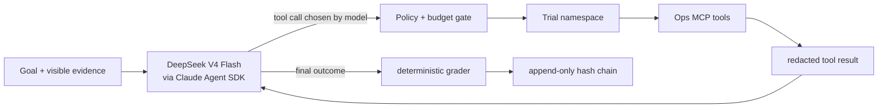

# M1 technical architecture

## Decision

The runtime follows the same high-level control pattern used by capable coding agents: a persistent session receives an objective and available tools, the model chooses an action, the environment executes it inside a constrained boundary, the result is appended to context, and the model continues until it can produce a final outcome. There is no static state graph and no predetermined tool order.

The Claude Agent SDK is the production harness. DeepSeek V4 exposes an Anthropic-compatible endpoint, so the SDK remains the session/tool/context layer while DeepSeek V4 Flash is the model. Domain capabilities are in-process MCP tools and Skills. A replay brain implements the same action contract for deterministic, credential-free M1 tests.

## Trust boundary

The model controls:

- hypothesis generation and revision;
- which allowed MCP tool to call and with what validated arguments;
- whether evidence is sufficient to stop;
- the narrative and structured candidate outcome.

The deterministic kernel controls:

- frozen manifest and configuration hashes;
- Blind ID mapping and seeded A/B order;
- Trial queue, leases, restart recovery, idempotency, and namespaces;
- allowed tools, approval classes, budgets, redaction, and artifact hashes;
- code scoring, Ledger append, replay comparison, and G1 verdict.

## M1 constraints

- M1 uses two versioned L0 smoke fixtures and two mock Contestant adapters. It does not claim that either real OpsMind implementation was executed.
- Live DeepSeek is wired but not required for G1 because credentials are external and must not enter the repository.
- SQLite is the executable local M1 store. Equivalent MySQL migration contracts are included for the ECS deployment path. The queue/lease abstraction is durable in SQLite for M1 and can be replaced by Redis without changing Runner semantics.
- No LangGraph package or graph-shaped workflow is present.

## Reference alignment

- Claude Agent SDK supplies the autonomous loop, sessions, built-in safety surface, MCP, permissions, and context management.
- DeepSeek V4 Flash uses the Anthropic-compatible API at `https://api.deepseek.com/anthropic` and supports tool use.
- The design borrows the useful Codex boundaries: resumable sessions, explicit tools, workspace isolation, approval/policy checks, bounded resources, complete event traces, and replayable evidence.

