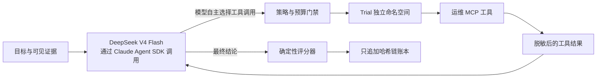

# M1 技术架构

## 架构决策

运行时采用强大编码 Agent 常见的高层控制模式：持久会话接收目标和可用工具，模型自主选择下一步行动，环境在受约束边界内执行该行动，并把结果追加回上下文；模型据此继续判断，直到能够给出最终结果。系统不使用静态状态图，也不预先规定工具调用顺序。

生产环境使用 Claude Agent SDK 作为 Agent 运行框架。DeepSeek V4 提供 Anthropic 兼容接口，因此 Claude Agent SDK 负责会话、工具和上下文管理，DeepSeek V4 Flash 负责模型推理。领域能力以进程内 MCP 工具和 Skills 的形式提供。确定性重放模型实现相同的行动协议，只用于无需密钥、结果可复现的 M1 测试。

## 信任边界

模型可以决定：

- 生成和修正假设；
- 调用哪个已授权的 MCP 工具，以及提交哪些通过校验的参数；
- 当前证据是否足以停止；
- 叙述性结论和结构化候选结果。

确定性内核负责决定：

- 冻结后的实验清单与配置哈希；
- 盲测身份映射和基于种子的 A/B 顺序；
- Trial 队列、租约、重启恢复、幂等与命名空间；
- 允许调用的工具、审批级别、预算、脱敏和产物哈希；
- 代码评分、Ledger 追加、重放对比和 G1 判定。

## M1 范围约束

- M1 使用两个带版本的 L0 冒烟测试夹具和两个模拟参评 Agent 适配器，不代表已经执行任何真实 OpsMind 参评实现。
- DeepSeek 实际调用链路已经接通，但 G1 不要求真实调用，因为密钥属于外部部署配置，不能进入代码仓库。
- SQLite 是 M1 可执行的本地数据存储；同时提供等价的 MySQL 迁移约定，供 ECS 部署使用。M1 的队列与租约抽象在 SQLite 中具备持久性，后续可以替换为 Redis，且无需改变 Runner 语义。
- 项目不包含 LangGraph 依赖，也不存在图形化的固定工作流。

## 参考架构对齐

- Claude Agent SDK 提供自主循环、会话、内置安全边界、MCP、权限和上下文管理。
- DeepSeek V4 Flash 通过 `https://api.deepseek.com/anthropic` 的 Anthropic 兼容接口提供模型与工具调用能力。
- 架构吸收了 Codex 的关键边界设计：可恢复会话、显式工具、工作区隔离、审批与策略检查、受限资源、完整事件轨迹，以及可重放证据。
