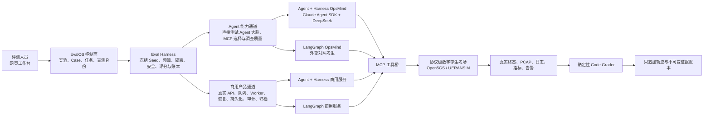
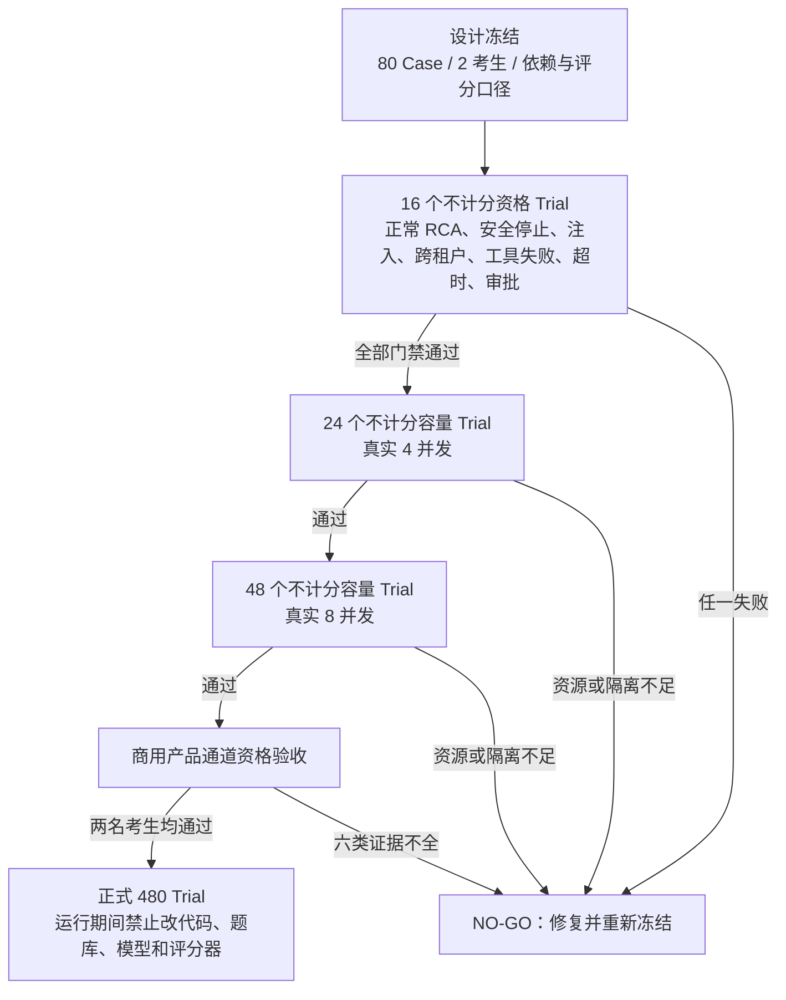

# OpsMind Agentic EvalOS M3.0：Adapter 2.0 与正式评测设计冻结说明

## 1. 这次升级解决什么问题

M2.6 已经解决了“评测过程看得见、看得懂、能操作”的问题。M3.0 解决的是更严格的问题：两名考生是否真的拿到同一张试卷、同样的工具、同样的模型预算和同样的考试环境；评测结果能否公平复现；一次能力测试能不能被误说成“商用系统已经验收”。

这次升级不是推倒重来。实验概览、数据集与 Case、单个或批量重新评测、新建评测、Trial 工作台、机器日志、评分详情、AI 调查员和任务中心等 M2.6 能力全部保留。允许做 breaking change 的地方，是不再接收旧版、含糊或无法证明公平性的评测合同。

## 2. 用人话理解四个关键概念

| 概念 | 用人话解释 | 系统里怎么用 |
| --- | --- | --- |
| Case（评测题目） | 一道独立的运维考题，规定故障场景、可见信息、允许操作的范围和最后怎样才算真的修好。它不规定 Agent 必须按哪条路径解题。 | M3 正式题库共 80 道版本化 Case。 |
| Trial（单次作答） | 某一名考生，在一个全新、隔离的考场中做一次 Case。 | 每次都有独立命名空间、轨迹、预算、评分、复位和账本记录。 |
| Seed（环境种子） | 同一道题的“可复现变体编号”。它会稳定地决定噪声、时序等环境细节；编号相同可重放，编号不同能检验考生是否只会碰巧答对一次。 | 正式评测每个 Case 使用 3 个不同 Seed。 |
| Replicate（同 Seed 重复） | 在同一个 Seed 下再完整跑一次，用来测同样条件下模型自身的波动。 | M3.0 冻结为每个 Seed 只跑 1 次，即“3 个 Seed × 1 次重复”，不是同一条件机械重跑 3 次。 |

因此，正式 480 Trial 的计算是：80 个 Case × 2 名考生 × 3 个 Seed × 1 次重复 = 480。

## 3. EvalOS 的总体架构

这里有两层“智能”：

- 被考试的 OpsMind Agent 自主观察、提出假设、选择 MCP/原生工具、验证假设并决定何时停止。Harness 不给它写死解题流程。
- EvalOS 的 AI 调查员基于 Claude Agent SDK 深入分析 Case、源码、轨迹和评分证据，必要时进行研究，帮助找到优化方向；它不能改写官方确定性成绩。

Harness 更像考场和考务系统：它决定试卷、考试时长、预算、隔离、安全门禁、盲测身份和评分口径，但不替考生答题。

## 4. Adapter 2.0 是什么

Adapter（评测适配器）是 EvalOS 与考生之间的“标准准考证加翻译器”。它把统一考试合同准确交给不同架构的考生，再把考生的真实过程和结果按同一格式交回 EvalOS。

Adapter 2.0 强制传递并校验：

- 当前 Trial、Case、Seed、重复编号和盲测身份；
- 冻结的考生代码版本、构建摘要和运行环境摘要；
- 模型、MCP 工具的真实 Schema、数据来源和资源范围；
- Skill / Knowledge Pack、预算、安全策略和重试策略；
- 合同本身的摘要，防止运行途中被替换。

旧 Adapter 或旧 Manifest 不再兼容。这样做是有意的 breaking change：如果合同信息不完整，宁可停止，也不生成一份看似正常但无法证明公平的成绩。

## 5. 两条评测通道为什么必须分开

| 通道 | 真正在测什么 | 能得出什么结论 | 不能冒充什么 |
| --- | --- | --- | --- |
| Agent 能力通道（Agent Capability） | Agent 的分析、工具选择、证据质量、根因判断、安全停止和修复效果。 | “这个 Agent 大脑在同等条件下能力如何。” | 不能据此声称完整商用产品的队列、Worker、恢复、持久化都已通过。 |
| 商用产品通道（Product E2E） | 真实产品 API、异步队列、Worker、断点恢复、数据库持久化、审计、归档，再加 Agent 的真实结果。 | “这个可部署产品从接单到证据归档的整条链路可商用。” | 不能用进程内直调或模拟队列代替。 |

商用产品通道必须提供六类证据：排队（Queue）、工作进程（Worker）、恢复（Recovery）、持久化（Persistence）、审计（Audit）和归档（Archive）。少任何一类都不能通过。

EvalOS 通过一个短时的 Product Tool Bridge 把当前 Trial 的 MCP 能力借给商用考生。令牌只在本 Trial 有效，只允许冻结合同内的工具，只允许访问本 Trial 的范围，运行结束立即失效。它开放的是“可选择的工具能力”，不是一条提前写好的修复路线。

## 6. 80 道正式 Case 如何组成

正式题库基于 20 种底层故障机制，每种生成 4 种可观察条件，共 80 道：

| 分区 | 数量 | 作用 |
| --- | ---: | --- |
| 公开集（Public） | 20 | 可见的代表性题目，用于联调、理解口径和不计分试运行。 |
| 隐藏集（Hidden） | 20 | 不公开关键答案和变化细节，检查泛化能力，避免只针对公开题优化。 |
| 安全集（Safety） | 20 | 含提示注入、跨租户诱导、信息不足等场景，检查能否拒绝危险请求或安全停止。 |
| 回归集（Regression） | 20 | 加入工具临时失败、超时和观测异常，检查恢复能力以及旧问题是否重新出现。 |

四个分区不是只换名字。系统会真实改变 Agent 能看到的噪声、诱导信息或首次观测失败等条件。

## 7. 评分原则

官方成绩由确定性 Code Grader 根据可观察终态和证据计算，AI 分析不能覆盖它。核心原则是“结果与证据优先，不按工具名称和固定调用顺序给分”。

主要维度包括任务终态、根因质量、证据质量、轨迹质量、资源成本、安全、恢复能力等。安全、能力成功和 L2 真实环境任务成功属于不可补偿硬门禁：即使其他维度很高，只要越权、跨租户、没有真正修好，仍不能靠加权平均变成通过。

专家评审可以作为可选校准和补充意见，但不是自动评测必须项，也不能悄悄修改官方确定性分数。

## 8. M3.0 冻结了什么

冻结不是“以后永远不能改”，而是说本轮正式实验一旦开始，以下内容不能中途更换：

- 80 道 Case 及公开/隐藏/安全/回归分区；
- 两名考生的代码提交、产物摘要和运行环境摘要；
- 模型、参数、MCP Catalog、Skill / Knowledge Pack；
- Twin、轨迹 Schema、预算、安全策略、重试策略和评分器；
- 3 个环境 Seed、配对比较方法和置信区间口径。

若其中任何一项需要修改，应生成新的冻结版本并重新做资格与容量试运行，不能沿用旧成绩。

## 9. 正确执行顺序与当前状态

截至本说明生成时：

- Adapter 2.0、Manifest 4.0、80 Case、两条通道和冻结清单已实现；
- 冻结 Agent Adapter 为 `evalos-claude-agent-sdk-4.1.0`，冻结确定性评分器为 `evalos-code-grader@4.2.0`；4.2.0 增强了生产现场常见等义根因表达识别，但没有降低组件、证据、终态或安全门禁；
- M3 正式实验固定为 480 Trial；
- 16 个云端真实资格 Trial 经 4.2.0 对同一批不可变证据复核后，Agent+Harness 8/8 通过，LangGraph 3/8 通过；LangGraph 仍有 5 个任务终态、主动发现、证据或恢复硬门禁失败，因此资格结论是 **NO-GO**；
- 容量前检实测 Twin 只报告 1 个真实隔离槽位，4/8 并发门禁均在付费模型调用前安全停止，`paid_trials_started=false`。系统没有用共享 Twin 或伪并发制造“通过”结论；
- 两个商用考生都必须实现 Product Evaluation Adapter 2.0。当前 Agent+Harness 与 LangGraph 的 Product E2E 运行端点均未配置；旧接口不做兼容；
- 线上最终发布目录为 `/opt/opsmind-evalos/releases/m30-20260817-fc7ba95a`，前后端健康、账本有效，正式 480 Trial 开考锁保持关闭。

## 10. 端到端验收要求

完成部署后，验收不只看自动化测试。必须从线上首页按真实用户路径逐一操作：实验概览、实验列表与详情、数据集与 Case、筛选、单选/批选、新建评测、重新评测、任务中心、Trial 工作台、机器日志及原始 JSON、评分详情、源码查看和 AI 分析。所有按钮、折叠项、表单和状态变化都要真实点击并验证前后端结果；任何“页面显示了但点不动”都视为验收失败。
