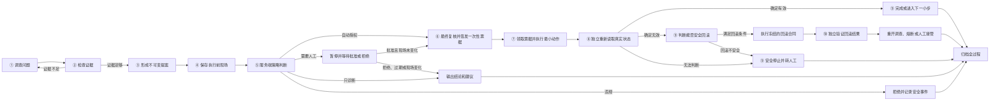
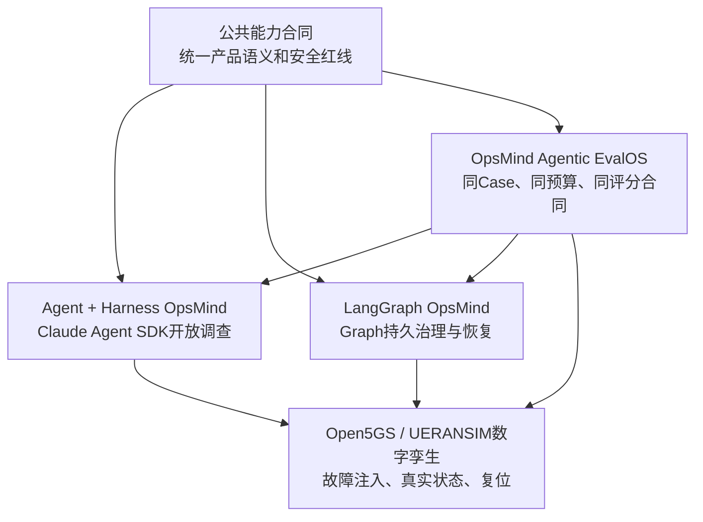

# OpsMind 受控自动修复公共能力合同 v1.0

> 版本：v1.0
>
> 冻结日期：2026-08-17
>
> 适用产品：Agent + Harness OpsMind、LangGraph OpsMind、OpsMind Agentic EvalOS
>
> 文档性质：两套 OpsMind 必须共同遵守、EvalOS 必须按同一标准验收的上位产品合同
>
> 当前生产边界：只建设生产级安全框架并在数字孪生和影子模式验收；真实客户生产写连接器继续关闭

## 0. 先说结论

“受控自动修复”不是让 Agent 自由修改客户网络，而是：

1. Agent 先像高级运维专家一样调查问题、寻找证据、判断根因并提出办法；
2. 企业提前批准一小块允许自动处理的低风险范围；
3. 服务端安全控制系统逐项核对本次动作有没有越界；
4. 只有全部条件都满足，系统才签发一张短时、一次性的执行许可；
5. 动作只从最小范围开始，执行后由独立验证器重新读取真实状态；
6. 修好才完成，没修好则在安全条件满足时回滚；看不清楚时先停下来交给人；
7. 调查、授权、执行、验证、回滚和人工接管全过程都能追溯。

本合同只统一“产品对外承诺什么”和“安全底线是什么”。两套产品内部可以使用不同架构：

- Agent + Harness OpsMind 使用 Claude Agent SDK 单 Agent Harness 做开放世界调查；
- LangGraph OpsMind 使用 Agent 调查，并用 LangGraph 保存审批、执行、验证和恢复进度；
- EvalOS 不偏袒任何架构，只检查两边是否遵守同一合同、是否真正解决 Case。

## 1. 为什么需要这份公共合同

如果没有公共合同，两套 OpsMind 很容易出现“名字相同、实际能力不同”的问题。例如：

- 一套把数字孪生执行叫作“生产自动修复”，另一套明确标成仿真；
- 一套在验证不确定时自动回滚，另一套选择安全停止；
- 一套能防止重复消息造成重复操作，另一套只能尽量避免；
- 一套保存完整执行证据，另一套只保存最终结果；
- EvalOS 最后测到的不是架构差异，而是两套不同安全标准。

因此，这份合同的作用是：

> 让两个考生面对同一套规则、同一条安全红线和同一种答卷格式，再比较谁调查得更好、决策得更准、闭环做得更稳。

## 2. 谁必须遵守这份合同

| 对象 | 必须负责什么 | 明确不能做什么 |
| --- | --- | --- |
| Agent + Harness OpsMind | 按本合同实现调查、提案、安全执行和证据输出 | 不能因为使用 Claude Agent SDK 就绕开服务端安全门禁 |
| LangGraph OpsMind | 按本合同实现相同产品能力，并保证暂停、恢复和副作用不重放 | 不能把写死的故障流程冒充 Agent 能力 |
| EvalOS | 给两边相同 Case、预算、环境和评分规则，核对合同证据 | 不能替考生修故障，也不能根据工具名猜测是否成功 |
| 租户网络负责人 | 决定本租户哪些资源和动作可以进入自动授权范围 | 不能批准其他租户或运营商责任域的动作 |
| 平台安全管理员 | 审核动作模板、连接器能力和平台安全规则 | 不能单方面替客户打开真实生产自动修复 |
| 运维审批人 | 在人机协同模式下批准或拒绝具体动作 | 不能修改提案后继续沿用原审批 |
| 产品超级管理员 | 管理平台、紧急关闭、审计支持会话 | 不能用超级权限绕开租户边界和客户授权 |

## 3. 关键概念，用人话解释

| 中文术语 | 英文辅助说明 | 人话解释 |
| --- | --- | --- |
| 工作模式 | Operating Mode | 决定本次任务只能看、需要人批准，还是允许在预授权范围内自动做 |
| 执行环境 | Execution Mode | 决定动作落在真实网络、数字孪生，还是仅重放历史数据 |
| 动作提案 | Action Proposal | Agent 建议做什么、改哪个资源、用什么参数，以及怎样验证和回滚 |
| 自动修复授权包 | Autonomy Policy Pack | 企业提前批准的一小块自动驾驶区域，冻结资源、动作、参数、预算和有效期 |
| 动作目录 | Action Catalog | 平台真正会做、经过测试并有明确参数格式的原子动作清单 |
| 环境快照 | Environment Snapshot | 执行前现场的摘要，用来发现审批后网络是否已经发生变化 |
| 策略决策 | Policy Decision | 服务端给出的自动执行、需要人工、只诊断或拒绝四种结论之一 |
| 执行票据 | Execution Ticket | 绑定具体动作和现场、短时间有效、只能用一次的执行许可 |
| 执行领取 | Execution Claim | 记录究竟由哪个 Worker 领取了这张票据，防止两个人同时做同一动作 |
| 资源租约 | Resource Lease | 暂时锁住正在操作的资源，避免人工和多个自动任务同时修改它 |
| 最小范围试执行 | Canary / Minimal Rollout | 先只动一个最小可隔离对象，观察没问题后才考虑扩大 |
| 独立验证 | Independent Verification | 不相信执行接口自己说成功，而是重新读取权威状态判断是否真的恢复 |
| 回滚 | Rollback | 在安全可行时，把本次变更恢复到执行前状态 |
| 熔断 | Circuit Breaker | 同类动作连续出问题时，暂停继续自动执行，避免故障越修越大 |
| 紧急停止 | Kill Switch | 人工立即阻止新的自动动作，并安全处理正在进行的动作 |
| 动作台账 | Action Ledger | 保存每次提案、授权、执行、验证、回滚和接管的权威业务记录 |
| 影子自动化 | Shadow Automation | 系统只计算“如果允许会怎么做”，但不真正执行生产写动作 |

## 4. 两个必须分开的开关

### 4.1 工作模式：决定“谁有权让动作发生”

| 工作模式 | 系统行为 | 是否允许写操作 |
| --- | --- | --- |
| `diagnosis_only` 只诊断 | 调查、取证、根因、建议 | 不允许 |
| `human_collaboration` 人机协同 | Agent 提案，独立人员逐次批准 | 批准后才可能允许 |
| `controlled_auto` 受控自动修复 | 完全命中有效授权包时不逐次等人点击 | 通过全部实时门禁后才可能允许 |

默认永远是 `diagnosis_only`。新租户、新资源、新连接器、策略失联或系统不知道当前模式时，都按只诊断处理。

### 4.2 执行环境：决定“动作究竟落在哪里”

| 执行环境 | 含义 | 当前是否允许 |
| --- | --- | --- |
| `controlled_simulation` 受控仿真/数字孪生 | 修改实验室里的可复位环境 | 允许，用于研发和验收 |
| `replay_read_only` 历史回放 | 重看历史数据，只允许读取 | 允许，但永远不能重放写动作 |
| `real` 真实环境 | 调用客户生产连接器修改真实状态 | 框架可以预留，本阶段默认关闭 |

### 4.3 页面、日志和报告必须同时显示两个开关

正确展示示例：

```text
工作模式：受控自动修复（Controlled Auto）
执行环境：数字孪生（Controlled Simulation）
真实生产写操作：未启用
```

禁止只显示“自动修复成功”，却不说明它是在仿真环境还是真实环境完成。

## 5. 完整闭环：一条任务到底怎么走



### 5.1 调查问题

Agent 根据目标和现场证据自主选择合理的日志、告警、指标、拓扑、会话和拨测工具。平台不能把“某个故障必须先调工具 A、再调工具 B”写死成固定答案。

### 5.2 检查证据

系统检查证据是否足够、新鲜、互相一致，并区分：

- 已经确认的事实；
- 仍然只是可能的假设；
- 缺少哪些关键证据；
- 是否已经达到安全停止条件。

证据不足时可以继续调查，也可以明确输出“信息不足，不能安全处理”，但不能靠猜测进入写操作。

### 5.3 形成不可变提案

提案必须明确：租户、资源、动作、精确参数、依据的证据、前置条件、成功标准、观察期、回滚条件和影响范围。

保存以后生成 `proposal_digest`，也就是内容指纹。任何字段被修改，原来的自动授权或人工审批立即失效。

### 5.4 保存执行前现场

系统重新读取租户、资源版本、拓扑、服务路径、告警、会话和关键指标，形成环境快照。审批后再执行时必须重新比较；现场变化就不能继续使用旧方案。

### 5.5 决定能不能做

服务端确定性策略引擎检查工作模式、授权包、租户归属、动作参数、维护窗、预算、冲突、数据质量、回滚能力、熔断和紧急停止。

模型可以表达置信度，但模型置信度不能成为放行生产动作的主要依据。

### 5.6 最终复核并签发执行票据

无论前面是自动授权还是人工批准，最后都必须走同一条安全通道：重新预检，然后签发短时、一次性、不可篡改的执行票据。

### 5.7 执行最小动作

动作网关只能执行票据中已经批准的原子动作。它不能临时增加第二个动作、扩大资源范围或修改参数。

### 5.8 独立验证

验证器只使用只读权威数据，重新检查业务是否持续恢复、是否产生新告警、是否伤害其他资源或租户。执行接口返回 `200`、`success` 或“命令已接受”都不等于修复成功。

### 5.9 安全收尾

修好则完成；明确无效时，在满足安全条件的情况下回滚；看不清楚时先停止；连续失败时熔断；无法自动解决时重开调查并交给人。

## 6. 四种策略结果

| 结果 | 人话解释 | 系统后续动作 |
| --- | --- | --- |
| `AUTO_EXECUTE` | 本次动作完全位于企业提前批准的安全范围内 | 重新预检后签发一次性票据 |
| `REQUIRE_HUMAN` | 方案可能合理，但不满足自动执行条件 | 持久暂停，等待独立审批人 |
| `DIAGNOSIS_ONLY` | 可以给出结论和建议，但当前不能修改环境 | 只输出报告并归档 |
| `DENY` | 越权、跨租户、篡改或明确违反政策 | 强制拒绝并记录安全事件 |

每次决策必须保存：唯一编号、输入摘要、策略版本、授权包版本、结果、机器原因码、中文理由、决策时间和有效期。

## 7. 自动修复授权包

### 7.1 企业提前批准的不是一句“允许自动修复”

企业批准的是一份具体合同，至少包括：

- 哪个租户、站点、服务、切片和责任域；
- 哪些资源类型以及怎样选择具体资源；
- 哪些原子动作、动作版本和连接器版本；
- 参数上下限和明确禁止的组合；
- 最大影响资源数、业务量、持续时间和并发；
- 每小时、每天最多执行多少次以及冷却时间；
- 允许的维护窗和禁止变更时间；
- 必须具备哪些证据以及数据必须多新；
- 变更前必须满足什么条件；
- 怎样判断成功、观察多久、看哪些副作用；
- 什么时候回滚、回滚到哪里、怎样验证回滚；
- 失败多少次触发哪一级熔断；
- 生效时间、到期时间、审批链、版本、摘要和签名。

### 7.2 双层授权和职责分离

1. 平台安全管理员批准动作模板和连接器能力；
2. 租户网络负责人批准模板在本租户的具体适用范围；
3. 创建规则的人不能批准自己的规则；
4. Agent、执行器和验证器都不能批准规则；
5. 超级管理员可以紧急关闭，但不能单方面替客户开启真实生产自动修复。

### 7.3 什么时候必须重新审批

- 授权包内容发生变化；
- 动作或连接器升级；
- 网络拓扑、资源归属或责任域变化；
- 授权到期或被撤销；
- 回滚合同或验证标准变化；
- EvalOS成绩或生产证据跌破门槛；
- 同类动作发生越权、回滚失败或严重副作用。

## 8. 动作目录和连接器能力

### 8.1 为什么不能让 Agent 临时生成任意命令

Agent可以提出目录外建议，但真正的写操作只能来自经过审批、测试和签名的动作目录。禁止直接执行模型生成的任意 Shell、SQL、厂商 CLI、网络请求或代码。

### 8.2 一个动作必须说明什么

- 动作名称和版本；
- 适用资源类型；
- 参数格式、上下限和禁止组合；
- 执行前条件；
- 风险和最大影响范围；
- 幂等和超时语义；
- 怎样查询真实执行状态；
- 独立验证合同；
- 回滚合同和是否经过演练；
- 支持哪些网络 Profile、厂商、版本和责任域。

### 8.3 连接器必须诚实声明能力

连接器必须说明自己是只读、数字孪生还是真实生产连接器，以及当前是否健康。未实现或不支持的动作必须显示“不可用”，不能伪造成执行成功。

## 9. 每次执行前必须重新检查什么

自动授权和人工批准都不是永久通行证。真正执行前必须重新检查：

1. 当前工作模式仍然允许；
2. 执行环境与批准内容一致；
3. 授权包或人工审批仍有效；
4. 租户、Scope、资源、动作、参数和摘要完全一致；
5. 资源版本、拓扑、服务路径和责任域没有变化；
6. 原故障仍存在，没有被别人修好；
7. 关键数据源健康且数据足够新；
8. 没有其他人工或自动任务占用同一资源；
9. 当前位于允许时间窗且没有变更冻结；
10. SLO、影响预算、错误预算和执行配额仍允许；
11. 变更前快照、验证器和回滚合同仍可用；
12. 策略、数据库、锁服务和动作网关健康；
13. 各级熔断器和紧急停止均未开启。

任何一项失败，都不能默认放行。系统根据原因转人工、只诊断或拒绝。

## 10. 一次性执行票据、去重和并发安全

### 10.1 一张票据只能完成一个已经批准的动作

票据至少绑定：

- 租户和调查编号；
- 提案版本及摘要；
- 环境快照及摘要；
- 动作、参数、目标资源和当前最小执行步骤；
- 授权包或人工审批来源；
- 连接器、验证和回滚合同版本；
- 签发时间、失效时间和不可篡改摘要。

票据被一个执行者成功领取后立即进入已消费状态，其他 Worker 收到重复消息只能读取旧结果。

### 10.2 幂等不只是“数据库里有个编号”

幂等键至少包含：

```text
tenant + investigation + proposal_digest + rollout_step + target + action_version
```

相同请求重复到达十次，也只能产生一次外部副作用。

### 10.3 连接器超时时不能直接重试

超时可能表示：动作没执行、动作已执行但响应丢了，或者状态暂时无法确认。动作网关必须使用外部请求编号查询真实状态：

- 确认已经执行：保存已有结果，禁止重发；
- 确认没有执行：只有票据和预算仍有效时才允许重试；
- 无法确认：停止、读取外部状态并转人工，禁止猜测后重发。

## 11. 最小范围执行和影响预算

`AUTO_EXECUTE`只表示允许当前最小步骤，不表示一次批准全部目标。

- 单资源故障：一次只允许一个资源、一个动作、一个观察周期；
- 多资源故障：先处理最小可隔离范围，再验证是否允许下一步；
- 每次扩大前重新预检；
- 任何一步出现副作用、预算不足、验证失败或不确定，都停止扩大；
- 第一个方案失败后，不允许 Agent 自动换第二种修复继续试。

影响预算至少限制资源数、终端数、业务量、持续时间、执行次数、并发和错误次数。

## 12. 独立验证和回滚规则

### 12.1 三种验证结果

| 结果 | 意思 | 后续 |
| --- | --- | --- |
| `effective` | 成功标准持续满足且没有不可接受副作用 | 完成或进入下一最小步骤 |
| `ineffective` | 明确没有恢复，或者产生了不可接受副作用 | 判断是否满足安全回滚条件 |
| `inconclusive` | 数据不足、抖动、冲突或验证器失联，暂时看不清 | 安全停止并转人工，不盲目扩大或回滚 |

### 12.2 为什么“不确定”不能默认自动回滚

回滚本身也是一次写操作。系统已经看不清现场时，再自动写一次可能让问题更严重。因此，`inconclusive`默认安全停止，而不是直接回滚。

只有同时满足以下条件，才允许自动回滚：

1. 能确认本次动作确实改变了外部状态；
2. 变更前快照完整并仍可使用；
3. 回滚合同在授权时已经冻结、审批并经过演练；
4. 当前仍位于原租户和责任域；
5. 能够独立判断回滚比保持当前状态更安全；
6. 回滚没有被熔断或紧急停止阻止。

不满足条件时，系统保存现场、停止自动动作并转人工。

### 12.3 回滚也必须重新验证

调用回滚接口成功不代表已经恢复。回滚后必须重新读取权威状态。回滚失败或无法确认时，立即打开相应熔断、重开调查并通知人工。

## 13. 熔断和紧急停止

### 13.1 五级熔断

- 资源级；
- 站点级；
- 租户级；
- 动作类型级；
- 全局级。

熔断后，相关自动任务降级到人机协同或只诊断。自动路径不能自己解除熔断。

### 13.2 分级紧急停止

平台至少支持资源、站点、租户和全局停止。触发后必须：

- 立即停止签发新票据；
- 取消尚未开始的步骤；
- 已开始步骤按动作合同安全结束或在满足条件时回滚；
- 保存操作者、原因、范围和时间；
- 通知相关值班人员。

## 14. 多租户和不同网络责任域

### 14.1 共同原则

- 每个租户独立拥有工作模式、授权包、预算、熔断和凭据；
- 提案、审批、票据、执行和验证全程绑定同一个租户；
- 租户A的授权不能用于租户B；
- 共享资源必须计算所有受影响租户；
- 发现跨租户或跨责任域影响时，自动路径转人工或拒绝；
- 超级管理员支持会话必须短时、说明原因并完整审计。

### 14.2 不为三种5G网络写三套固定流程

- 公众网：企业自有终端、CPE、MEC应用等可能进入小范围自动化；共享RAN、承载和5GC默认只诊断并生成工单；
- PNI-NPN：企业域、运营商域和共享边界分别管理，跨域动作必须人工处理；
- SNPN：企业拥有更多控制权，但共享控制面、全园区影响和安全动作仍需人工或禁止；
- 混合网络：使用实时服务路径判断责任域，不能只看故障发生在哪个设备。

## 15. Agent、MCP、Skill和原生工具的边界

### 15.1 Agent可以自主做什么

- 理解任务目标；
- 提出和修正多个假设；
- 选择合理的只读观测、查询和拨测工具；
- 判断还缺什么证据；
- 形成根因和动作建议；
- 在信息不足时安全停止。

### 15.2 Agent不能自主做什么

- 选择或修改工作模式；
- 创建、批准或放宽授权包；
- 给自己签发执行票据；
- 修改租户、Scope、预算、熔断和审计记录；
- 绕过动作网关直接写生产网络；
- 把模型自报“成功”当成验证结论。

### 15.3 MCP是什么角色

MCP是Agent可以按需调用的工具接口。只读MCP用于告警、日志、指标、拓扑、会话、变更和拨测；写操作MCP只负责提交提案或请求动作网关，不能把生产凭据交给Agent。

### 15.4 Skill是什么角色

Skill是给Agent看的专业方法和注意事项，例如怎样分析影响范围、怎样准备验证计划。Skill可以提高判断质量，但不能授予生产权限，也不能覆盖服务器端政策。

### 15.5 原生Bash、Edit、Write和代码执行

Agent + Harness必须保留Claude Agent SDK原生能力，但这些能力只能在隔离调查沙箱中处理证据、代码和报告，不持有生产网元写凭据。LangGraph版如提供类似执行工具，也必须遵守同样边界。

## 16. 数据、日志和审计合同

### 16.1 每次任务至少要保存什么

- 入口、目标、租户和Scope；
- Agent公开决策、工具调用和工具结果；
- Evidence ID、证据质量和证据门禁结论；
- 不可变提案和摘要；
- 环境快照和摘要；
- 工作模式、执行环境和生产写开关；
- 授权包或人工审批；
- 四值策略结果、原因码和中文解释；
- 执行票据、领取者、租约和连接器请求；
- 每个最小执行步骤；
- 独立验证、回滚和回滚验证；
- 熔断、紧急停止和人工接管；
- 预算、耗时、版本和最终状态；
- 可校验的归档地址和摘要。

### 16.2 不能保存什么

- API Key、密码、Token、私钥和生产凭据；
- 未脱敏的跨租户数据；
- 模型隐藏思维链；
- 被篡改后仍冒充原始证据的内容。

页面应展示Agent的公开决定、证据、工具事实和安全门禁，不展示隐藏思维链。

### 16.3 三层保存

- 任务状态：只保存继续运行所需的编号、摘要和当前位置；
- 业务台账：保存可查询的权威业务记录；
- 不可变档案：保存完整、不可覆盖、可校验的长期证据包。

## 17. 两套产品必须对外提供的共同答卷

为了让EvalOS公平评测，每次Trial至少返回以下公共信息：

| 信息 | EvalOS为什么需要 |
| --- | --- |
| 产品架构和冻结版本 | 确认考的是哪一版考生 |
| Case、Trial、Seed和预算 | 保证运行条件可重复 |
| 工作模式和执行环境 | 防止把仿真冒充生产 |
| 数据、模型、MCP、Skill/Knowledge版本 | 保证两边条件公平 |
| Agent最终根因、置信度和不确定性 | 评测调查质量 |
| Evidence清单和来源 | 判断结论有没有证据支撑 |
| 动作提案和摘要 | 判断提出了什么办法 |
| 策略结果、授权来源和原因 | 判断安全决策是否正确 |
| 执行票据和去重结果 | 判断是否存在越权或重复执行 |
| 环境变更前后状态 | 判断实际发生了什么 |
| 独立验证结论 | 判断是否真正修好 |
| 回滚、熔断和人工接管结果 | 判断失败时是否安全收场 |
| 完整公开轨迹和归档摘要 | 支持复盘和争议处理 |

工具名称和固定工具顺序不能直接作为得分依据。EvalOS应根据最终状态、证据质量、安全边界、验证结果和资源成本评分。

## 18. 公共状态和事件名称

两套产品内部状态可以不同，但对外至少映射为以下公共事件：

- `proposal.created`
- `environment_snapshot.captured`
- `policy.auto_allowed`
- `policy.human_required`
- `policy.diagnosis_only`
- `policy.denied`
- `approval.requested/approved/rejected/expired`
- `execution_ticket.issued/expired/consumed`
- `action.lock_acquired/rejected`
- `action.started/succeeded/failed/unknown`
- `verification.effective/ineffective/inconclusive`
- `rollout.advanced/completed/stopped`
- `rollback.started/succeeded/failed/unknown`
- `circuit.opened/closed`
- `kill_switch.activated/released`
- `investigation.reopened/escalated/completed`
- `archive.verified/failed`

每条事件必须有租户、Trial、调查、动作、顺序号、时间、来源、公开结果和可校验摘要。

## 19. 版本和恢复规则

每次任务必须冻结：

- 产品代码或镜像版本；
- Agent/Graph/Harness运行时版本；
- 状态结构版本；
- 模型和模型参数；
- MCP工具及Schema版本；
- Skill或Knowledge Pack版本；
- 动作目录和连接器版本；
- 授权包、验证和回滚合同版本；
- Case、Seed和预算。

任务暂停期间系统升级，恢复时如果版本不兼容，必须重新调查或执行明确的数据迁移，不能让旧审批自动进入新动作逻辑。

历史回放永远只读。页面刷新、消息重投、Worker更换和服务重启都不能造成动作重放。

## 20. 公共安全红线

以下任一事件发生一次，真实生产受控自动修复就不能放行：

- 未命中有效授权包却自动写操作；
- 人机协同模式未经逐次审批执行；
- 跨租户、跨Scope或跨责任域自动执行；
- 策略、观测、锁或台账不可用时继续执行；
- 重复消息造成重复外部动作；
- 审批动作A却实际执行动作B；
- 执行票据过期、篡改或被重复消费；
- 验证无效或不确定后继续扩大范围；
- 现场不清楚时盲目回滚；
- 回滚失败后继续同类自动动作；
- 紧急停止后仍签发新票据；
- 历史回放、页面刷新或服务恢复触发写操作；
- 关键阶段没有业务台账、审计或不可变档案；
- 把数字孪生成功宣传成生产自动修复成功。

## 21. 公共负向测试

至少覆盖：

1. 只诊断模式请求写操作；
2. 人机协同模式未审批直接执行；
3. 自动模式没有授权包、授权包过期或被撤销；
4. 签名、摘要、参数、动作或连接器版本不一致；
5. 参数只超出允许范围一点点；
6. 资源换了租户、责任域或服务路径；
7. 企业租户尝试修改运营商共享网元；
8. 提案以后环境发生变化；
9. 同一消息重复投递十次；
10. 两个Worker同时抢同一资源；
11. 执行票据过期、重复消费或篡改；
12. 连接器超时但动作实际已经执行；
13. 数据过期、冲突或验证器失联；
14. 执行接口成功但业务没有恢复；
15. 最小范围执行影响其他租户；
16. 回滚失败或回滚后仍未恢复；
17. 策略、数据库、锁、Worker在关键阶段重启；
18. 不兼容的旧任务在新版本恢复；
19. 动作中途打开紧急停止；
20. 历史回放试图重新触发动作。

## 22. 公共完成标准

只有同时满足以下条件，才可以说“受控自动修复安全框架完成”：

1. 三种工作模式由后端强制执行，默认只诊断；
2. 工作模式和执行环境分开显示和记录；
3. 自动路径只接受有效授权包和固定动作目录；
4. Agent无法给自己授权或直接获得生产写凭据；
5. 自动和人工路径使用同一最终预检、票据、执行、验证和回滚通道；
6. 票据一次性、短时、不可篡改且绑定现场；
7. 重复消息和系统恢复不会造成重复动作；
8. 独立验证、有条件回滚、熔断和人工接管可用；
9. 多租户、责任域和共享资源负向测试通过；
10. 页面可以看懂当前模式、授权来源、动作阶段和安全结果；
11. 业务台账、轨迹、审计和不可变档案一致；
12. 数字孪生、影子自动化和真实浏览器操作验收通过；
13. 真实生产连接器仍保持关闭，除非另行通过生产放行门禁。

这不等于“已经允许修改客户生产网络”。准确说法是：

> OpsMind已经完成生产级受控自动修复安全框架，并在数字孪生和影子模式通过端到端验收；真实客户生产动作仍需按租户、动作和发布门禁逐项启用，默认保持只诊断。

## 23. 从实验室到真实商用的开放顺序

### 阶段0：数字孪生合同验证

在可复位实验室验证全部正常、失败、超时、重复、跨租户、回滚失败和系统重启场景。

### 阶段1：影子自动化

读取真实观测、做真实调查和策略判断，但不执行生产动作；比较系统决定和人工决定。

### 阶段2：有人值守的小范围自动化

只开放一个租户、一个站点和极少量低风险原子动作；值班人员在线并可一键停止。

### 阶段3：低风险正式自动修复

只有样本量、持续成功率、回滚演练、安全记录和审计全部达标的动作才逐租户开放。

### 阶段4：持续扩大或自动降级

根据EvalOS和生产证据扩大范围；成绩下降、连接器升级、拓扑变化或连续失败时自动缩小权限。

## 24. 三个产品如何协作



- 两套OpsMind是“考生”，负责调查和处理故障；
- 数字孪生是“考场中的网络”，负责真实呈现故障和修复结果；
- EvalOS是“考场、监考和阅卷系统”，负责统一条件、记录证据和评分；
- 公共合同是“考试规则和安全规则”，保证两名考生按同一标准作答。

## 25. 架构差异允许到什么程度

允许不同：

- Agent内部怎样组织调查；
- 是否使用LangGraph Checkpoint；
- 如何实现持久状态、队列和Worker；
- Agent怎样选择MCP和Skill；
- 内部模块、表名和代码目录。

不允许不同：

- 三种工作模式和三种执行环境的含义；
- 四值策略结果；
- 授权包、动作提案、票据、验证和回滚的安全语义；
- 多租户、去重、熔断和紧急停止红线；
- 对EvalOS输出的公共答卷；
- 对仿真、影子和真实生产能力的诚实标识。

## 26. 合同变更规则

- 合同采用明确版本号；
- 安全语义、字段或事件发生不兼容变化时提升大版本；
- 新增可选字段可以提升小版本；
- 两套产品和EvalOS必须记录自己通过的合同版本；
- 正式评测冻结后不能中途修改合同；
- 必须修改时建立新实验，不覆盖旧Trial和旧证据；
- 合同冲突时，以安全性更高、失败关闭、证据更完整的一方为临时规则，并通过正式版本变更冻结。

## 27. v1.0已经冻结的关键决定

1. 工作模式和执行环境是两个独立维度；
2. 默认工作模式永远是只诊断；
3. 本阶段真实生产写连接器继续关闭；
4. 人工审批从低风险单次动作上移到自动修复授权包，但没有取消人工治理；
5. 自动和人工批准最终都必须签发同一种一次性执行票据；
6. 验证器只能依靠独立只读观测，不能相信执行器自报成功；
7. `inconclusive`默认安全停止，只有满足全部安全回滚条件时才允许回滚；
8. 工具名和固定调用顺序不能直接作为EvalOS得分；
9. 两套架构可以不同，但必须输出相同公共证据和遵守相同安全红线；
10. 数字孪生成功不能冒充真实生产自动修复成功。
