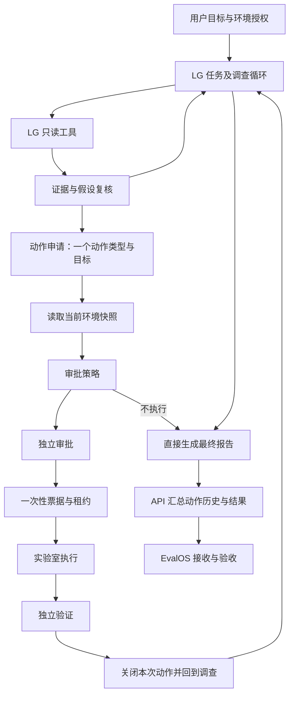
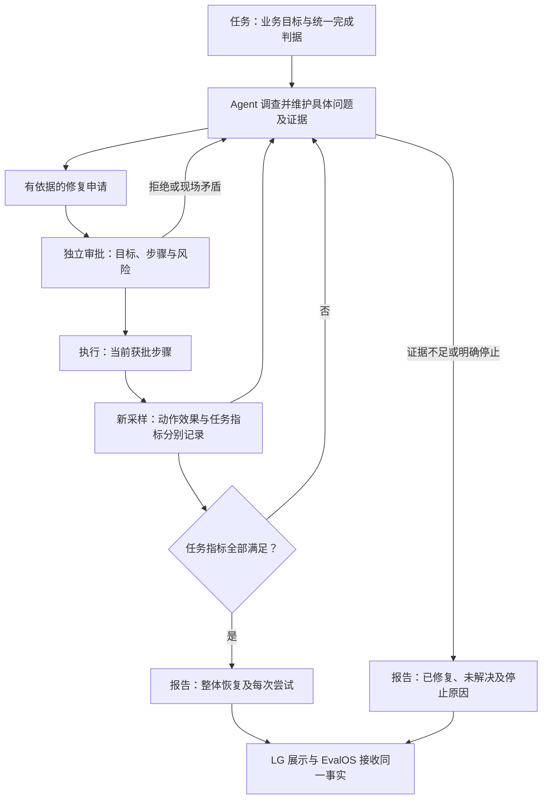

# LG 外围架构审查：状态、验证与任务闭环

审查范围：LG e34773bd0484b33bf0c101d70d1262fd67190447 的图路由、动作合同、调查记忆、审批和执行安全层、协议实验室适配器、最终结果投影；EvalOS LG 接收器；direct-04 的 113 条事件和上一轮只读获取的线上实验室函数及原始回执。代码与日志交叉审查，没有运行新 Trial 或修改产品代码，不代表完成全部源码形式化验证。AH 未改。

## 结论

存在跨模块的结构性错误，核心是动作效果、场景完成、整体业务恢复、诊断确定性被相互代替。不是 LangGraph 或独立审批本身错误，也不能仅靠增加节点、提示词或延长审批修复。现有已正确实现的当前动作引用、独立审批、一次性票据、租约、历史保全和修复后调查循环应保留。需要统一事实的定义及各层责任。

## 当前主要路径

## 已确认的结构缺陷

### 1. 局部场景成功被提升为全局健康

线上实验室 recovery_view 对 sctp-blocked 只检查服务、注册、会话和动作次数。原始回执同一时刻 task_success=true，但 ping_dn=false、dns=false。LG protocol_lab/actions.py 的 read_state 把 task_success 映射为 health；actions/safety.py 再把它变成 fault_still_present；policy.py 用该标志决定能否处理新动作。目标名称虽传入，业务判定实际仍取同一场景全局布尔值。

危险不在有门禁，而在门禁拿错事实：修好 N2 不能证明 N6 已健康。动作结果、具体故障、整体任务必须分别描述。

### 2. 调查工具与验证器没有共同的业务路径合同

LG 普通 ping/curl/dig 未绑定 UE TUN；实验室 connectivity_view 明确指定 uesimtun0。Agent 记录没有充分表达实际源接口、目的、路径、成功判据，收到真实错误后容易过度推断远端故障。注册/会话工具还可能走 mysql.shared，返回 unavailable；实验室验证器却能读到本轮 UE 日志。不能要求 Agent 对它拿不到或未得到解释的事实负责。

正确目标是同一作用域、同一探测源、同一服务目标、同一判据，调查与验证分别新采样；不能直接复用模型的成功结论，也不能把不可用写成业务失败。

### 3. 不执行一个动作，会直接结束整项调查

builder.py 中策略 DIAGNOSIS_ONLY/DENY 直接路由到 finalize；本轮第二提案收到 policy.fault_no_longer_present 后没有返回冲突调查。此时应保持禁止写入，但把“策略看到什么、Agent看到什么”的冲突交还调查。拒绝某个动作不等于否定调查任务。用户明确停止、全局紧急停止仍必须尊重；未知写入必须先对账，不能自动重试写入。

### 4. 当前的 rollout 并非异构修复方案

ActionProposal 只有一个 action_type 和一个 parameters；rollout_plan 是该动作在目标上的顺序，目标不能跨步骤重复。它支持分目标铺开，不能等同于“N2动作→路由动作→业务验证”的完整方案。Agent 可关闭前一动作后提出下一动作，但还受以上全局健康映射和终止路由影响。线上实验室 len(changes)==1 仍作为成功条件，说明多动作能力未在端到端落实。

### 5. 结果不是统一的任务事实，而是从最后一条动作推算

LG repair_delivery 取 actions[-1] 生成 final_action_ref 和 recovery_verified；文字说明只枚举实际尝试。因此最后一个未执行提案可以改变恢复标志，而历史成功文字仍保留。EvalOS LG 接收器也要求最后一行绑定最终验证。该校验对“最后动作”的防串票有价值，但不能替代整项任务的业务结果。更不能简单改成“任意一次成功就整体成功”，那会忽略后来故障或有害写入。

### 6. 诊断结论与业务结果聚合粒度过粗

finalize 只有在整体 gate=confirmed 才输出 root_cause，否则 null，具体结论放入 best_available_conclusion。保守发布是合理的；问题是已确认/已修复的局部事实与尚未确认的剩余问题不能清楚并列呈现。本轮 N2 的因果证据不应因数据面新疑问而在产品主结果中变得像“完全没有根因”。不应强行提升 gate，应按具体假设和验证范围展示状态。

## 合理部分与必须保留的边界

- Agent 自主选工具、继续调查；证据门核对可追溯性、作用域、反证与结论等级。passed 和 confirmed 不同不是天然错误。
- 当前申请由持久状态直接定位，日志供历史和审计，不应重回遍历日志寻找审批对象。
- 审批与执行分离；批准绑定确切方案摘要、目标和有效期；执行票据与租约阻止重复写入。
- 成功或已知失败后关闭旧授权，保留历史；新的动作不得沿用旧批准。
- 无可靠逆操作时不伪造回滚；未知执行结果先对账。
- 发布版本登记与运行事实一致、最终准确候选真实验收后才提升主线。

## 建议的轻量职责分配

这是职责图，不要求新增一个工作流引擎或再叠一套状态机。沿用已有图与存储，将 task_success/health/fault_still_present 的错误替代关系删除。任务事实保留业务条件及其带时间的证据；动作事实保留具体执行、验证和审批。界面与接收器使用一致合同，不能再自行猜整体状态。

如果实现整包多步骤审批：步骤明确、顺序和目标冻结、每步前置条件可检查、局部效果和整体成功分开；只执行已经批准的步骤。执行后发现的新修复仍需新批准。不能借此把未知后续步骤全部自动授权。

## 最低端到端验证组合

1. N2 修复后业务仍失败：记录第一步有效，任务继续，不能标全部恢复或关闭后续调查。
2. 首次动作失败，第二次成功：保留两次记录，最终任务按新业务证据判断。
3. 首次成功后出现未执行提案：不能改写历史动作结果，也不能以最后提案直接确定任务状态。
4. 调查与验证冲突：不写入，继续只读核对；不能直接用任一布尔值压过另一方证据。
5. 两个必要步骤：第一步满足局部标准即可进入获批后续步骤，不能要求第一步完成全部业务，也不能因动作次数为二判失败。
6. 普通探测源与隧道源区分；验证使用当前环境新采样；旧批准不能用于新步骤或新方案。

## 范围说明

直接错误横跨 LG、LG 专属实验室网关、共享控制器的成功语义和 EvalOS LG 接收合同。可以不动 AH 核心、模型和评分权重，但不能声称只改 LG 提示词就能彻底解决。共享控制器修改必须保证其他消费者既有逻辑，通过明确作用域与回归证明；不得为通过LG验收削弱全局安全规则或伪造结果。

数据面的 NAT/回程冲突仍是待实证假设，不在本架构审查中升级为已确认网络根因。详见同目录 LG_direct04_N2成功与数据通路失败_日志复核_20260910.md。